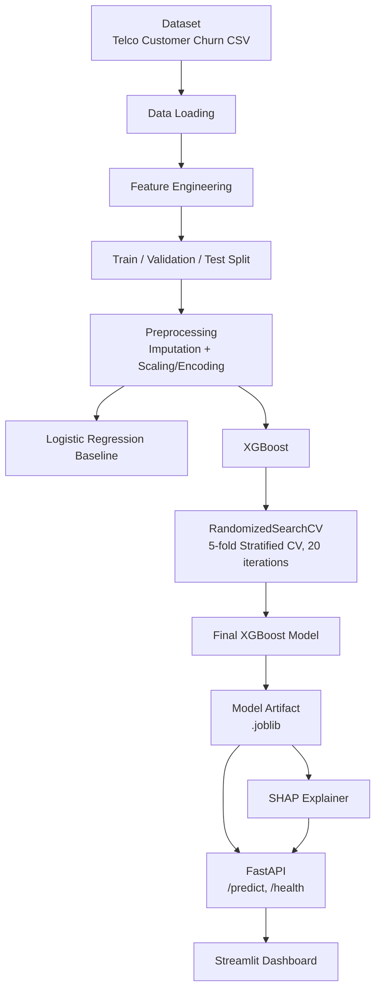

# Customer Churn Prediction — Explainable ML

> An end-to-end customer churn prediction system using XGBoost, feature engineering, SHAP explainability, FastAPI, and Streamlit.

[](https://www.python.org/)
[](https://xgboost.readthedocs.io/)
[](https://shap.readthedocs.io/)
[](https://fastapi.tiangolo.com/)
[](https://streamlit.io/)
[](#license)

**Note:** This is an educational/portfolio project. Deployment is currently postponed — see [Deployment](#deployment).

---

## Table of Contents

- [Problem Statement](#problem-statement)
- [Architecture](#architecture)
- [Dataset](#dataset)
- [Machine Learning Pipeline](#machine-learning-pipeline)
- [Feature Engineering](#feature-engineering)
- [Modeling](#modeling)
- [Results](#results)
- [Explainability](#explainability)
- [FastAPI Service](#fastapi-service)
- [Streamlit Dashboard](#streamlit-dashboard)
- [Tech Stack](#tech-stack)
- [How to Run Locally](#how-to-run-locally)
- [Project Structure](#project-structure)
- [Testing](#testing)
- [Deployment](#deployment)
- [Future Work](#future-work)
- [License](#license)

---

## Problem Statement

Subscription businesses lose revenue when customers churn — and losing them silently is far
more expensive than catching the risk early. This project predicts the probability that a
customer will churn, using their account and service details, and explains **why** using
SHAP so the prediction is interpretable rather than a black box.

The system:
- Predicts churn probability for a given customer
- Performs feature engineering on raw account/service data
- Uses XGBoost as the classification model
- Explains individual predictions using SHAP
- Exposes predictions through a FastAPI REST endpoint
- Provides an interactive Streamlit dashboard for non-technical use

---

## Architecture



**Flow summary:** raw data is loaded, engineered into new features, split, and preprocessed
(median/most-frequent imputation + scaling/one-hot encoding). A logistic regression baseline
and an XGBoost model are trained, with XGBoost tuned via `RandomizedSearchCV` (5-fold
stratified CV, 20 iterations, PR-AUC scoring). The final model is saved as a `.joblib`
artifact and loaded by FastAPI, which serves predictions alongside SHAP-based explanations
consumed by the Streamlit dashboard.

---

## Dataset

**[Telco Customer Churn](https://www.kaggle.com/datasets/blastchar/telco-customer-churn)** (IBM sample data, via Kaggle)

- 7,043 customers, 21 original columns
- Class distribution:

| Class | Count | % |
|---|---|---|
| No (stayed) | 5,174 | 73.5% |
| Yes (churned) | 1,869 | 26.5% |

Imbalanced enough that accuracy alone is a misleading metric — see [Results](#results) for why F1/PR-AUC are used.

---

## Machine Learning Pipeline

**Numerical features:**
```
Median Imputation → StandardScaler
```

**Categorical features:**
```
Most-Frequent Imputation → OneHotEncoder
```

`customerID` is dropped — it's a unique identifier with no predictive signal and would leak
row-level identity into the model.

---

## Feature Engineering

Engineered features added on top of the raw columns:

| Feature | Description |
|---|---|
| `AvgMonthlySpend` | Average spend per month of tenure |
| `ServiceCount` | Count of subscribed services per customer |
| `IsMonthToMonth` | Binary flag for month-to-month contract type |
| `UsesElectronicCheck` | Binary flag for electronic check payment method |

These were added because contract flexibility and payment method are known churn drivers in
subscription businesses, and raw columns alone didn't capture that signal directly.

---

## Modeling

```
Logistic Regression (baseline)
            +
        XGBoost
            ↓
   RandomizedSearchCV
            ↓
  5-fold Stratified CV
            ↓
       20 iterations
            ↓
      PR-AUC scoring
```

---

## Results

Evaluated on a held-out test set:

| Metric | XGBoost |
|---|---:|
| Accuracy | **0.7947** |
| Precision | **0.6524** |
| Recall | **0.4875** |
| F1 | **0.5580** |
| PR-AUC | **0.6631** |

**Confusion Matrix**

| | Predicted: No | Predicted: Yes |
|---|---:|---:|
| **Actual: No** | 703 | 73 |
| **Actual: Yes** | 144 | 137 |

> **Why not just accuracy?** The dataset is imbalanced (~26.5% churn). A model predicting
> "No churn" for everyone would score ~73.5% accuracy while catching zero at-risk customers.
> F1 and PR-AUC better reflect performance on the minority (churn) class that actually matters.

**Honest read of these numbers:** recall (48.75%) is the weakest metric here — the model
misses over half of actual churners. That's the clearest next lever to pull (see
[Future Work](#future-work)).

---

## Explainability

Predictions are explained per-customer using SHAP (both global and local explanations).

**Actual API response structure:**
```json
{
  "churn_probability": 0.2302,
  "prediction": "No",
  "explanations": [
    { "feature": "tenure", "shap_value": -0.18, "direction": "negative" },
    { "feature": "Contract_Month-to-month", "shap_value": 0.12, "direction": "positive" },
    { "feature": "MonthlyCharges", "shap_value": 0.07, "direction": "positive" }
  ]
}
```

- **Global SHAP** — which features matter most across the whole dataset
- **Local SHAP** — why this specific customer got this specific prediction
- Each feature's contribution is labeled positive (pushes toward churn) or negative (pushes away from churn)
- Top 5 contributing features are returned per prediction

**Important caveat:** SHAP values explain what the model relied on to make a decision — they
are not causal evidence. A high positive SHAP value means the model *used* that feature to
push its prediction up, not that changing the feature would definitely change the outcome.

---

## FastAPI Service

**Endpoints:**

```
GET  /health
POST /predict
```

**`GET /health`** response:
```json
{
  "status": "healthy",
  "model_loaded": true
}
```

**`POST /predict`** takes customer details and returns both the prediction and its SHAP
explanation (structure shown in [Explainability](#explainability)).

---

## Streamlit Dashboard

The dashboard:
- Accepts customer information through a form
- Calls the FastAPI service to calculate churn probability
- Displays the prediction (churn / no churn)
- Displays the SHAP explanation for that prediction
- Communicates with the API over HTTP — no model logic duplicated in the dashboard itself

---

## Tech Stack

| Layer | Tools |
|---|---|
| Data & Modeling | Python, pandas, NumPy, scikit-learn, XGBoost |
| Explainability | SHAP |
| Serving | FastAPI, Uvicorn |
| Interface | Streamlit |
| Persistence | joblib |
| Testing | pytest |
| Version control | Git / GitHub |

---

## How to Run Locally

```powershell
# 1. Install dependencies
pip install -r requirements.txt

# 2. Place the dataset at data/raw/dataset.csv

# 3. Run the API
uvicorn api.main:app --reload

# 4. Run the dashboard (separate terminal)
streamlit run dashboard/app.py
```

---

## Project Structure

```
├── data/
│   └── raw/
│       └── dataset.csv
├── src/
│   ├── data_loader.py
│   ├── preprocessing.py
│   ├── split_data.py
│   ├── feature_engineering.py
│   ├── model_pipeline.py
│   ├── cross_validation.py
│   ├── tuning.py
│   ├── evaluation.py
│   ├── explainability.py
│   ├── model_artifact.py
│   └── train.py
├── api/
│   └── main.py
├── dashboard/
│   └── app.py
├── models/
│   └── xgboost_churn_pipeline.joblib
├── tests/
├── requirements.txt
└── README.md
```

---

## Testing

```
7 passed
```

Coverage includes:
- Preprocessing logic
- Feature engineering functions
- API health check
- API prediction endpoint

---

## Deployment

Planned deployment target:
```
FastAPI     → Render
Streamlit   → Streamlit Community Cloud
```

**Deployment is currently postponed.** No live URL is published yet — this section will be
updated once deployed, rather than linking a placeholder that doesn't work.

---

## Future Work

- Threshold optimization to improve recall (currently the weakest metric at 48.75%)
- Class-imbalance strategies (SMOTE, class-weighting) to catch more true churners
- Drift detection for feature distribution shifts over time
- CI/CD pipeline for automated retraining
- Model versioning / registry
- Dashboard UX improvements
- Complete deployment (Render + Streamlit Community Cloud)
- API integration tests

---

## License

MIT — this is an educational/portfolio project, free to use and adapt.
