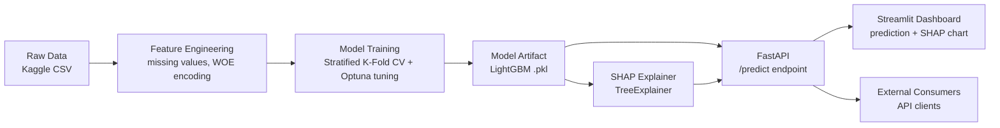

# Credit Risk Scoring — Explainable ML

> Predicting customer default/churn risk with a tuned gradient-boosted model, explained per-prediction with SHAP, and served through a live API + dashboard.

[](https://www.python.org/)
[](https://lightgbm.readthedocs.io/)
[](https://fastapi.tiangolo.com/)
[](https://streamlit.io/)
[](#license)

**[Live Demo](#)** &nbsp;•&nbsp; **[API Docs](#)** &nbsp;•&nbsp; **[Dataset](https://www.kaggle.com/datasets/blastchar/telco-customer-churn)**


---

## Table of Contents

- [Problem Statement](#problem-statement)
- [Architecture](#architecture)
- [Dataset](#dataset)
- [Results](#results)
- [Explainability](#explainability)
- [Tech Stack](#tech-stack)
- [How to Run Locally](#how-to-run-locally)
- [Project Structure](#project-structure)
- [Future Work](#future-work)
- [License](#license)

---

## Problem Statement

Lenders and subscription businesses need to identify high-risk customers — those likely to
default on a loan or churn — *before* it happens, not after. A model that only outputs a
probability isn't enough for real decision-making: risk teams need to know **why** a customer
was flagged, so the decision is auditable and actionable.

This project builds an end-to-end system that:
1. Predicts the probability of default/churn for a given customer
2. Explains *which factors* drove that prediction, per individual case
3. Is served as a live API and an interactive dashboard, not just a notebook

---

## Architecture



**Flow summary:**
1. Raw data is cleaned, encoded, and split (train/val/test, stratified for class imbalance)
2. A LightGBM model is trained and tuned against a logistic regression baseline
3. The trained model and a SHAP explainer are both loaded into a FastAPI service
4. The API returns a prediction **and** the top contributing features for that specific case
5. A Streamlit dashboard consumes the same model to give a human-friendly interface

---

## Dataset

**[Telco Customer Churn](https://www.kaggle.com/datasets/blastchar/telco-customer-churn)** (IBM sample data, via Kaggle)

- ~7,043 customers, 21 columns
- Features: tenure, contract type, monthly/total charges, service subscriptions, demographics
- Target: `Churn` (Yes/No) — imbalanced (~27% positive class)

*(Swap in [Home Credit Default Risk](https://www.kaggle.com/c/home-credit-default-risk) for a more complex, multi-table version of this problem.)*

---

## Results

| Model | F1 Score | PR-AUC | Notes |
|---|---|---|---|
| Logistic Regression (baseline) | `TBD` | `TBD` | class-weighted, no tuning |
| LightGBM (tuned) | `TBD` | `TBD` | Optuna, 5-fold CV, 30 trials |

**Improvement over baseline:** `TBD`% F1 · `TBD`% PR-AUC

> **Why F1 / PR-AUC instead of accuracy?** The target class is imbalanced (~27% churn rate).
> A model that always predicts "no churn" would score ~73% accuracy while being useless.
> F1 and PR-AUC penalize that failure mode and better reflect real-world usefulness.

---

## Explainability


Every prediction is explained using **SHAP TreeExplainer**:
- The **dashboard** shows a per-customer bar chart of which features pushed the prediction up or down
- The **API** returns a `top_features` field with each feature's SHAP contribution, so downstream systems can log or audit decisions

Example API response:
```json
{
  "probability": 0.82,
  "prediction": 1,
  "top_features": {
    "contract_type_woe": 0.41,
    "tenure_months": -0.27,
    "monthly_charges": 0.15,
    "total_charges": -0.09,
    "tech_support": 0.06
  }
}
```

---

## Tech Stack

| Layer | Tools |
|---|---|
| Data & Modeling | Python, pandas, scikit-learn, LightGBM, Optuna |
| Explainability | SHAP |
| Serving | FastAPI |
| Interface | Streamlit |
| Deployment | Hugging Face Spaces / Render |
| Experiment tracking (optional) | MLflow |

---

## How to Run Locally

```bash
# 1. Clone and install dependencies
git clone https://github.com/<your-username>/credit-risk-scoring-explainable-ml.git
cd credit-risk-scoring-explainable-ml
pip install -r requirements.txt

# 2. Download the dataset from Kaggle into data/raw.csv

# 3. Prepare data
python -m src.data_prep --input data/raw.csv --target Churn --outdir data/processed

# 4. Train models
python -m src.train --train data/processed/train.csv --val data/processed/val.csv --target Churn

# 5. Generate SHAP explanations
python -m src.explain --model models/lightgbm_model.pkl --data data/processed/test.csv --target Churn

# 6. Run the API
uvicorn api.main:app --reload

# 7. Run the dashboard (separate terminal)
streamlit run dashboard/app.py
```

---

## Project Structure

```
├── data/
│   ├── raw.csv
│   └── processed/
├── src/
│   ├── data_prep.py       # cleaning, encoding, splitting
│   ├── train.py             # baseline + tuned LightGBM
│   └── explain.py           # SHAP explanations
├── api/
│   └── main.py                # FastAPI service
├── dashboard/
│   └── app.py                   # Streamlit UI
├── models/                        # saved artifacts + metrics.json
├── docs/                            # README images/gifs
├── requirements.txt
└── README.md
```

---

## Future Work

- Add drift detection to monitor feature distribution shifts over time
- Set up CI/CD for automated retraining when performance degrades
- Add a model registry (MLflow) for version comparison
- Extend to a multi-table dataset (Home Credit) to test scalability

---

## License

MIT — free to use and adapt.
